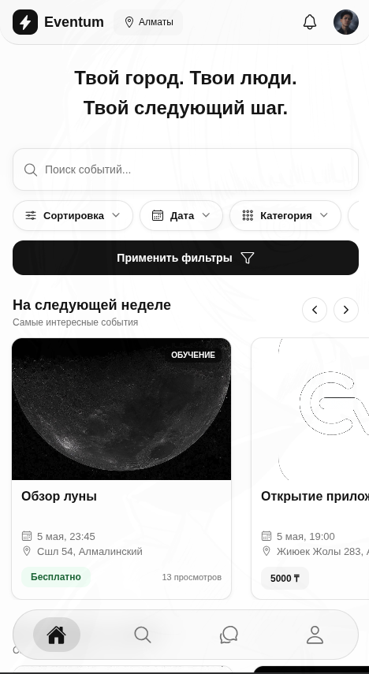
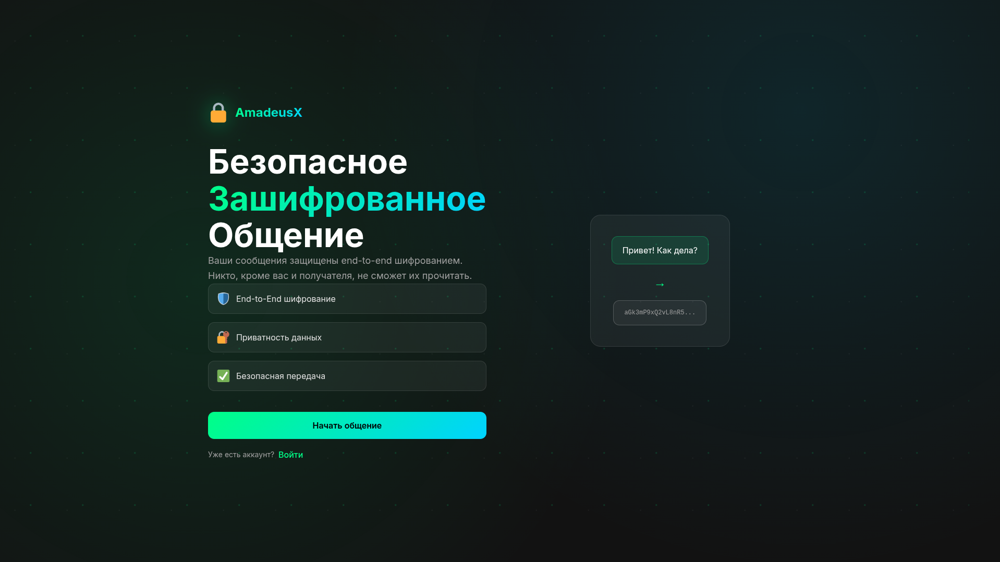

  
  # Hi there, I'm Lekim ZLavdinov 👋
  
  ### Full-Stack & Mobile Engineer | System Architect
  
  *Based in Almaty, Kazakhstan 🇰🇿*
  
  
  
  

   

  

---

### 👨‍💻 About Me

I'm a **Full-Stack and Mobile Developer** who loves building end-to-end applications. For me, development isn't just about writing code; it's about designing a solid architecture, setting up a reliable server, and delivering a fast, responsive UI to the end user.

I enjoy taking full ownership of projects—from sketching the database schema to deploying the final product. 

- 🚀 **Core Stack:** Building high-performance web apps with **React / Node.js** and cross-platform mobile experiences with **React Native**.
- ⚙️ **Architecture & Ops:** Strong background in **Linux administration**, Docker, and designing complex relational databases (PostgreSQL/SQL).
- 🤖 **AI Integration:** Actively using LLMs and AI tools to speed up development, automate workflows, and tackle complex system design.
- 🌱 **Currently Exploring:** Deep diving into modern stacks — **Next.js (App Router), Expo (EAS), Serverless**, and AI integration in mobile clients.
- 🎯 **Looking for:** Challenging engineering roles, open-source collaboration, and building scalable products from scratch.
- 📫 **Reach me at:** **leka.false@gmail.com** or **[Telegram](https://t.me/qeleran)**

---

### 🚀 Featured Projects

#### 📱 [Eventum](https://github.com/Qoziwe/Eventum)
> *A high-load event management platform. Built to handle real-time updates and complex data filtering, wrapped in a smooth cross-platform interface.*

  

 

**Tech Stack:** `React Native` | `Node.js` | `PostgreSQL` | `Docker`  
🔗 [Source Code](https://github.com/Qoziwe/Eventum) | 🌐 [Live Demo](https://qoziwe.github.io/Eventum/)

 

#### 💻 [AmadeusX](https://github.com/Qoziwe/AmadeusX)
> *An automated service system built with scalability in mind. Focuses on secure data processing, rapid deployment, and modern architectural patterns.*

  

 

**Tech Stack:** `Python` | `Django` | `REST API` | `Linux Server`  
🔗 [Source Code](https://github.com/Qoziwe/AmadeusX) | 🌐 [Live Demo](https://amadeusx-web.onrender.com/)

---

### 🛠️ Tech Stack & Tools

  
<b>Languages</b>

   
  
  
  
  
  
  
  

 

  
<b>Frontend & Mobile</b>

   
  
  
  
  
  

 

  
<b>Backend & Frameworks</b>

   
  
  
  
  

 

  
<b>Architecture & Infrastructure</b>

   
  
  
  
  

---

### 📊 GitHub Stats & Activity

  
  
  
    
  
  <picture>
    <source media="(prefers-color-scheme: dark)" srcset="https://raw.githubusercontent.com/Qoziwe/Qoziwe/output/github-contribution-grid-snake-dark.svg">
    <source media="(prefers-color-scheme: light)" srcset="https://raw.githubusercontent.com/Qoziwe/Qoziwe/output/github-contribution-grid-snake.svg">
    
  </picture>

---

  <i>"Architecting reliable systems, building fast applications, and writing clean code."</i>

