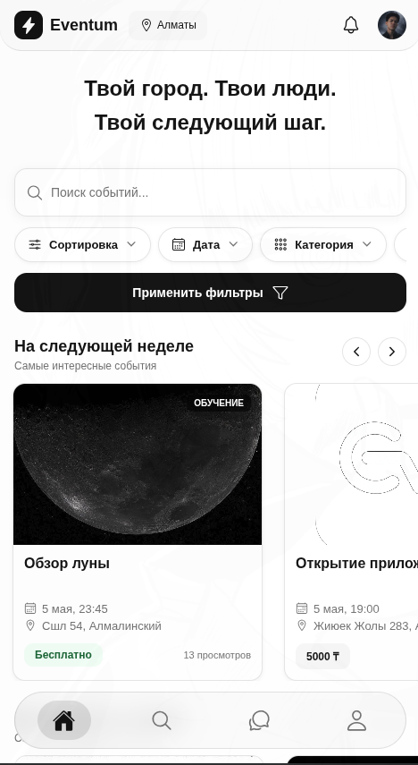
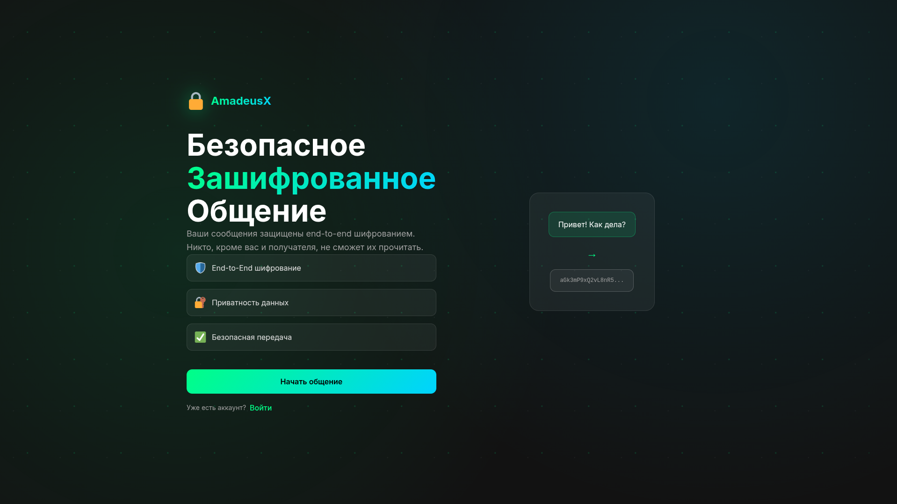

  
  # Hi there, I'm Lekim ZLavdinov
  
  ### Full-Stack & Mobile Engineer | System Architect
  
  *Based in Almaty, Kazakhstan 🇰🇿*
  
  
  
  

   

  

---

### About Me

I'm a **Full-Stack and Mobile Developer** who loves building end-to-end applications. For me, development isn't just about writing code; it's about designing a solid architecture, setting up a reliable server, and delivering a fast, responsive UI to the end user.

I enjoy taking full ownership of projects—from sketching the database schema to deploying the final product. 

- **Core Stack:** Building high-performance web apps with **React / Node.js** and cross-platform mobile experiences with **React Native**.
- **Architecture & Ops:** Strong background in **Linux administration**, Docker, and designing complex relational databases (PostgreSQL/SQL).
- **AI Integration:** Actively using LLMs and AI tools to speed up development, automate workflows, and tackle complex system design.
- **Currently Exploring:** Deep diving into modern stacks — **Next.js (App Router), Expo (EAS), Serverless**, and AI integration in mobile clients.
- **Looking for:** Challenging engineering roles, open-source collaboration, and building scalable products from scratch.
- **Reach me at:** **leka.false@gmail.com** or **[Telegram](https://t.me/qeleran)**

---

### Engineering Philosophy

I focus on understanding systems deeply — from database structure and backend logic to infrastructure and networking. I value clean architecture, automation, reliability, and building solutions that are secure and maintainable from day one.

---

### What I Build

- Full-stack web applications
- Cross-platform mobile apps
- Real-time systems (chat, notifications, live updates)
- Secure backends with end-to-end encryption
- Database architectures and optimization
- Containerized deployment pipelines
- Admin panels and moderation tools

---

### Featured Projects

#### [Eventum](https://github.com/Qoziwe/Eventum)
> *Designed the full system architecture and data model. Built a Flask backend with real-time WebSocket messaging, JWT authentication, race‑condition‑safe ticket purchases, content moderation, organizer analytics, and an admin panel. Dockerized the entire stack and wrote a production deployment guide. Developed a cross‑platform React Native client with a custom glassmorphism UI.*

  

 

**Tech Stack:** `React Native` | `Flask` | `PostgreSQL` | `Socket.IO` | `Docker` 
🔗 [Source Code](https://github.com/Qoziwe/Eventum) | [Live Demo](https://qoziwe.github.io/Eventum/)

 

#### [AmadeusX](https://github.com/Qoziwe/AmadeusX)
> *Built a zero‑knowledge E2EE messenger with Flask and Web Crypto API. Implemented AES‑256‑GCM encryption entirely in the browser, real‑time WebSocket communication, invitation system, disappearing messages, auto‑lock, and emoji‑based key verification. Hardened the server with strict CSP, SRI, service worker, rate limiting, and deployed via Cloudflare Tunnel.*

  

 

**Tech Stack:** `Python` | `Flask` | `Web Crypto API` | `Socket.IO` | `PostgreSQL`
🔗 [Source Code](https://github.com/Qoziwe/AmadeusX) | [Live Demo](https://amadeusx-web.onrender.com/)

---

### Core Stack

  
  
  
  
  
  
  
  
  
  

### Also Experienced With

  
  
  
  
  
  

---

### GitHub Stats & Activity

  
  
  
    
  
  <picture>
    <source media="(prefers-color-scheme: dark)" srcset="https://raw.githubusercontent.com/Qoziwe/Qoziwe/output/github-contribution-grid-snake-dark.svg">
    <source media="(prefers-color-scheme: light)" srcset="https://raw.githubusercontent.com/Qoziwe/Qoziwe/output/github-contribution-grid-snake.svg">
    
  </picture>

---

  <i>"From infrastructure to user experience, I enjoy owning the entire technology stack."</i>

